# YouTube Music Room — Architecture Design

> สถานะ: **รออนุมัติ** — ยังไม่เริ่มเขียนโค้ด
> Stack: Next.js (App Router) + TypeScript strict + Tailwind + Supabase (Postgres / Realtime / Auth) + YouTube Data API v3 + YouTube IFrame Player API + Vercel

---

## 1. System Architecture

### 1.1 หลักการออกแบบ 5 ข้อ

| # | หลักการ | ผลต่อการออกแบบ |
|---|---------|------------------|
| 1 | **Database คือ Source of Truth เพียงหนึ่งเดียว** | ไม่มี in-memory state บน server (Vercel serverless ไม่มี state ร่วมกันอยู่แล้ว) ทุกการตัดสินใจอ่านจาก Postgres |
| 2 | **Server clock คือเวลาเดียวที่เชื่อได้** | `started_at` มาจาก `now()` ใน Postgres เท่านั้น Client คำนวณ offset ของนาฬิกาตัวเองเทียบ server |
| 3 | **Write ทุกอย่างผ่าน Route Handler** | Client ใช้ anon key อ่านอย่างเดียว (SELECT + Realtime) ส่วน mutation วิ่งผ่าน `/api/*` ที่ตรวจ permission แล้วเรียก RPC ด้วย service role |
| 4 | **Mutation ที่แข่งกันต้องเป็น Atomic ใน Postgres** | ใช้ `SECURITY DEFINER` function + `pg_advisory_xact_lock` + partial unique index ไม่ใช่ logic ใน JS |
| 5 | **Realtime = สัญญาณ, ไม่ใช่ข้อมูล** | Event ใช้บอกว่า "มีอะไรเปลี่ยน" แต่ไม่เคยสมมติว่าได้ครบ → มี resync path เสมอ |

### 1.2 Data Flow ภาพรวม

```
                         ┌──────────────────────────────────────┐
                         │             Browser                  │
                         │                                      │
                         │  React UI ──► fetch /api/*  (write)  │
                         │      ▲                               │
                         │      │ supabase-js (anon key)        │
                         │      │   • SELECT (RLS)              │
                         │      │   • Realtime subscribe        │
                         │      │                               │
                         │  YouTube IFrame Player ──────────────┼──► youtube.com
                         │   (postMessage เท่านั้น)              │     (เสิร์ฟ media เอง)
                         └──────┬────────────────────────▲──────┘
                                │ HTTPS                  │ WebSocket
                                ▼                        │
        ┌───────────────────────────────────────┐        │
        │       Next.js บน Vercel (Edge/Node)    │        │
        │                                       │        │
        │  Server Components ─ bootstrap SSR    │        │
        │  Route Handlers  ─ validate (Zod)     │        │
        │        │            ├─ authz check    │        │
        │        │            └─ call RPC       │        │
        │        │                              │        │
        │  YOUTUBE_API_KEY (server only) ───────┼──► YouTube Data API v3
        │  SUPABASE_SERVICE_ROLE_KEY ───────────┤        │
        └────────────────┬──────────────────────┘        │
                         │ postgres                      │
                         ▼                               │
        ┌────────────────────────────────────────────────┴──────┐
        │                     Supabase                          │
        │  PostgreSQL ─ tables + RPC + RLS + indexes            │
        │  Realtime   ─ postgres_changes (WAL) + Presence       │
        │  Auth       ─ anonymous sign-in → upgrade ภายหลัง      │
        └───────────────────────────────────────────────────────┘
```

**ข้อบังคับที่ architecture นี้บังคับใช้เชิงโครงสร้าง:**
- `YOUTUBE_API_KEY` และ `SUPABASE_SERVICE_ROLE_KEY` อยู่ในไฟล์ใต้ `lib/server/` ที่มี `import 'server-only'` → ถ้าเผลอ import จาก Client Component โปรเจกต์จะ **build fail** ไม่ใช่แค่ lint เตือน
- Browser คุยกับ youtube.com ผ่าน IFrame Player API เท่านั้น — server ไม่เคยแตะ media stream, ไม่ proxy, ไม่ download, ไม่ดึง direct URL
- เว็บเราไม่มี ad network, ไม่มี ad slot, ไม่มี script ของบุคคลที่สาม โฆษณาที่อาจโผล่ใน player เป็นของ YouTube เองซึ่งเราไม่แตะต้องและไม่พยายามบล็อก

### 1.3 Runtime แต่ละส่วน

| ส่วน | Runtime | เหตุผล |
|------|---------|--------|
| `app/page.tsx`, `app/room/[roomCode]/page.tsx` | Node (RSC) | bootstrap data + cookie ของ Supabase |
| `/api/youtube/search` | Node | ต้องใช้ Postgres cache + secret |
| `/api/rooms/**` | Node | service role + RPC |
| Player / Realtime | Browser | ต้องเป็น Client Component (`'use client'`) |

---

## 2. Architecture Diagram

```mermaid
flowchart TB
  subgraph B["Browser"]
    UI["React UI<br/>(Client Components)"]
    RT["supabase-js<br/>Realtime + SELECT"]
    YP["YouTube IFrame<br/>Player API"]
    CLK["Clock Offset<br/>Estimator"]
  end

  subgraph N["Next.js / Vercel"]
    RSC["Server Components<br/>(bootstrap)"]
    RH["Route Handlers<br/>Zod → AuthZ → RPC"]
    YT["YouTube Data API client<br/>+ Postgres cache"]
  end

  subgraph S["Supabase"]
    PG[("PostgreSQL<br/>tables + RPC + RLS")]
    SR["Realtime<br/>postgres_changes + presence"]
    AU["Auth<br/>anonymous → email/OAuth"]
  end

  YTAPI["YouTube Data API v3"]
  YTCDN["youtube.com<br/>(player + media + ads)"]

  UI -->|"POST/DELETE /api/*"| RH
  UI --> RSC
  RSC --> PG
  RH --> PG
  RH --> YT
  YT --> YTAPI
  YT -.->|"cache read/write"| PG
  RT <-->|"WebSocket"| SR
  SR -.->|"WAL"| PG
  UI --> RT
  UI --> YP
  YP <-->|"iframe postMessage"| YTCDN
  CLK -->|"/api/time (RTT)"| RH
  CLK --> YP
  UI --> AU
  AU --> PG

  style YTCDN fill:#2a1215,stroke:#c0392b
  style PG fill:#10241b,stroke:#27ae60
```



**เส้นทางที่จงใจ "ไม่มี"**: ไม่มีลูกศรจาก Next.js server ไป youtube.com media, ไม่มี WebSocket server ของเราเอง, ไม่มี backend แยก

---

## 3. Database ER Diagram

```mermaid
erDiagram
  auth_users ||--|| profiles : "1:1 (trigger)"
  profiles   ||--o{ rooms        : "owns"
  profiles   ||--o{ room_members : "membership"
  profiles   ||--o{ queue_items  : "added_by"
  rooms      ||--o{ room_members : "has"
  rooms      ||--o{ queue_items  : "has"
  rooms      ||--|| playback_states : "1:1"
  queue_items ||--o| playback_states : "currently playing"
  rooms      ||--o{ rate_limits   : "throttle"

  profiles {
    uuid id PK "= auth.users.id"
    text display_name
    text avatar_url
    bool is_guest
    timestamptz created_at
    timestamptz updated_at
  }

  rooms {
    uuid id PK
    text code UK "Crockford Base32 x6"
    text name
    uuid owner_id FK
    bool is_locked "queue ปิดรับเพลง"
    bool allow_guest_add
    bool allow_member_skip
    int  max_queue_size
    timestamptz created_at
    timestamptz updated_at
  }

  room_members {
    uuid id PK
    uuid room_id FK
    uuid user_id FK
    enum role "OWNER|MEMBER|GUEST"
    timestamptz joined_at
    timestamptz last_seen_at
  }

  queue_items {
    uuid id PK
    uuid room_id FK
    text video_id "^[A-Za-z0-9_-]{11}$"
    text title
    text channel_title
    text thumbnail_url
    int  duration "seconds > 0"
    bigint position "UNIQUE(room_id,position)"
    enum status "WAITING|PLAYING|PLAYED|SKIPPED|REMOVED"
    uuid added_by FK
    timestamptz started_at
    timestamptz ended_at
    timestamptz created_at
    timestamptz updated_at
  }

  playback_states {
    uuid room_id PK-FK
    uuid queue_item_id FK
    text video_id
    bool is_playing
    timestamptz started_at "anchor เวลา server"
    timestamptz paused_at
    int  current_position "วินาทีที่ freeze ไว้"
    bigint version "กัน event มาผิดลำดับ"
    timestamptz updated_at
  }
```

---

## 4. Database Schema

> SQL เต็มจะอยู่ใน `supabase/migrations/` ตอน Phase 2 — ด้านล่างคือฉบับสมบูรณ์ที่ตั้งใจจะใช้

### 4.1 Extensions + Enums

```sql
create extension if not exists pgcrypto;

create type public.member_role  as enum ('OWNER','MEMBER','GUEST');
create type public.queue_status as enum ('WAITING','PLAYING','PLAYED','SKIPPED','REMOVED');
```

### 4.2 profiles

```sql
create table public.profiles (
  id           uuid primary key references auth.users(id) on delete cascade,
  display_name text not null default 'Listener'
               check (char_length(display_name) between 1 and 40),
  avatar_url   text check (avatar_url is null or avatar_url ~ '^https://'),
  is_guest     boolean not null default true,
  created_at   timestamptz not null default now(),
  updated_at   timestamptz not null default now()
);

-- สร้าง profile อัตโนมัติทุกครั้งที่มี auth user ใหม่ (รวม anonymous)
create function public.handle_new_user() returns trigger
language plpgsql security definer set search_path = public as $$
begin
  insert into public.profiles (id, display_name, is_guest)
  values (
    new.id,
    coalesce(new.raw_user_meta_data->>'display_name', 'Listener ' || left(new.id::text, 4)),
    coalesce(new.is_anonymous, true)
  )
  on conflict (id) do nothing;
  return new;
end $$;

create trigger on_auth_user_created
  after insert on auth.users
  for each row execute function public.handle_new_user();
```

### 4.3 rooms

```sql
create table public.rooms (
  id                uuid primary key default gen_random_uuid(),
  code              text not null unique check (code ~ '^[0-9ABCDEFGHJKMNPQRSTVWXYZ]{6}$'),
  name              text not null default 'Music Room'
                    check (char_length(name) between 1 and 60),
  owner_id          uuid not null references public.profiles(id) on delete cascade,
  is_locked         boolean not null default false,
  allow_guest_add   boolean not null default true,
  allow_member_skip boolean not null default false,
  max_queue_size    int not null default 200 check (max_queue_size between 1 and 1000),
  created_at        timestamptz not null default now(),
  updated_at        timestamptz not null default now()
);

create index rooms_owner_idx on public.rooms (owner_id);
-- code มี unique index อยู่แล้ว → lookup ตอน join เป็น O(log n)
```

**Room code alphabet**: `0123456789ABCDEFGHJKMNPQRSTVWXYZ` — **Crockford Base32** (0-9 A-Z ตัด `I L O U`) = 32 ตัวพอดี → 32⁶ = **1,073,741,824** combination

> เปลี่ยนจากที่ออกแบบไว้ตอนแรก (`ABCDEFGHJKLMNPQRSTUVWXYZ23456789`) ตอนลงมือทำ Phase 1 เพราะชุดเดิม **normalize ไม่ได้**: ตัด `0 1 I O` ออกทั้งหมด พอผู้ใช้พิมพ์ `O` มาเราไม่รู้ว่าเขาหมายถึงอะไร ส่วน Crockford ตัดแค่ `I L O U` → แปลง `I`/`L` → `1` และ `O` → `0` ได้อย่างไม่กำกวม (ดู `lib/room/code.ts`)

### 4.4 room_members

```sql
create table public.room_members (
  id           uuid primary key default gen_random_uuid(),
  room_id      uuid not null references public.rooms(id) on delete cascade,
  user_id      uuid not null references public.profiles(id) on delete cascade,
  role         public.member_role not null default 'GUEST',
  joined_at    timestamptz not null default now(),
  last_seen_at timestamptz not null default now(),
  unique (room_id, user_id)
);

create index room_members_user_idx on public.room_members (user_id);
create index room_members_room_idx on public.room_members (room_id);
-- บังคับว่ามี OWNER ได้ห้องละ 1 คน
create unique index room_members_single_owner_idx
  on public.room_members (room_id) where role = 'OWNER';
```

### 4.5 queue_items

```sql
create table public.queue_items (
  id            uuid primary key default gen_random_uuid(),
  room_id       uuid not null references public.rooms(id) on delete cascade,
  video_id      text not null check (video_id ~ '^[A-Za-z0-9_-]{11}$'),
  title         text not null check (char_length(title) between 1 and 300),
  channel_title text check (char_length(channel_title) <= 200),
  thumbnail_url text check (thumbnail_url is null or thumbnail_url ~ '^https://'),
  duration      int not null check (duration > 0 and duration <= 36000),
  position      bigint not null,
  status        public.queue_status not null default 'WAITING',
  added_by      uuid references public.profiles(id) on delete set null,
  started_at    timestamptz,
  ended_at      timestamptz,
  created_at    timestamptz not null default now(),
  updated_at    timestamptz not null default now(),

  constraint queue_items_position_unique unique (room_id, position)
);

-- ★ invariant: หนึ่งห้องมีเพลง PLAYING ได้มากสุด 1 เพลง (บังคับที่ระดับ DB)
create unique index queue_items_one_playing_idx
  on public.queue_items (room_id) where status = 'PLAYING';

-- ★ กันเพลงซ้ำใน queue ที่ยังไม่เล่น
create unique index queue_items_no_dup_pending_idx
  on public.queue_items (room_id, video_id) where status in ('WAITING','PLAYING');

-- ★ query ร้อนที่สุด: "หาเพลง WAITING ถัดไปของห้องนี้"
create index queue_items_next_waiting_idx
  on public.queue_items (room_id, position) where status = 'WAITING';

-- query: แสดง queue ทั้งหมด (รวม history)
create index queue_items_room_position_idx
  on public.queue_items (room_id, position desc);
```

**เหตุผลที่ `position` เป็น `bigint` แบบ monotonic ไม่เคยใช้ซ้ำ:** ทำให้ `UNIQUE(room_id, position)` ใช้ได้กับทุก row รวมของที่เล่นจบแล้ว → เป็น **ตัวกันชนสุดท้าย** ถ้า advisory lock พลาด INSERT จะ error แทนที่จะได้ position ซ้ำเงียบ ๆ

### 4.6 playback_states

```sql
create table public.playback_states (
  room_id          uuid primary key references public.rooms(id) on delete cascade,
  queue_item_id    uuid references public.queue_items(id) on delete set null,
  video_id         text check (video_id is null or video_id ~ '^[A-Za-z0-9_-]{11}$'),
  is_playing       boolean not null default false,
  started_at       timestamptz,
  paused_at        timestamptz,
  current_position int not null default 0 check (current_position >= 0),
  version          bigint not null default 0,
  updated_at       timestamptz not null default now(),

  -- ถ้ากำลังเล่น ต้องมี anchor เสมอ
  constraint playback_playing_needs_anchor
    check (not is_playing or (started_at is not null and queue_item_id is not null))
);
```

#### ความหมายของ field (นิยามให้ชัด — ทั้งระบบพึ่งตรงนี้)

| สถานะ | ความหมาย |
|-------|----------|
| `is_playing = true` | `position(t) = current_position + (t − started_at)` โดย `t` คือเวลา server |
| `is_playing = false` | `position(t) = current_position` (คงที่) และ `paused_at` = เวลาที่กดหยุด |
| เริ่มเพลงใหม่ | `current_position = 0`, `started_at = now()`, `paused_at = null` |
| กด Pause | `current_position = position(now())`, `is_playing = false`, `paused_at = now()` |
| กด Play ต่อ | `started_at = now()`, `is_playing = true`, `paused_at = null` (`current_position` คงเดิม) |
| Seek ไป S | `current_position = S`, `started_at = now()` ถ้ากำลังเล่น |

`started_at` **ไม่ใช่** "เวลาที่เพลงเริ่ม" แต่คือ **anchor ล่าสุด** — ออกแบบแบบนี้เพราะทำให้ pause/resume/seek ใช้สูตรเดียวกันหมด ไม่ต้องแยกเคส

`version` เพิ่มขึ้นทุกครั้งที่เขียน → client ที่ได้ realtime payload มาช้า/ผิดลำดับจะ **ทิ้ง** payload ที่ `version` ต่ำกว่าที่ถืออยู่

### 4.7 ตารางเสริม (cache + rate limit)

```sql
-- cache ผลค้นหา YouTube (ประหยัด quota — ดูหัวข้อ 13)
create table public.youtube_search_cache (
  query_key  text primary key,          -- normalize: lower + trim + collapse space
  results    jsonb not null,
  fetched_at timestamptz not null default now()
);
create index yt_cache_fetched_idx on public.youtube_search_cache (fetched_at);

-- cache metadata ราย video (videos.list = 1 unit)
create table public.youtube_videos (
  video_id      text primary key check (video_id ~ '^[A-Za-z0-9_-]{11}$'),
  title         text not null,
  channel_title text,
  thumbnail_url text,
  duration      int not null,
  embeddable    boolean not null default true,
  fetched_at    timestamptz not null default now()
);

-- rate limit แบบ atomic ใน DB (ไม่ต้องพึ่ง service ภายนอก)
create table public.rate_limits (
  bucket_key  text not null,            -- 'search:<user_id>' | 'room:<room_id>:add'
  window_start timestamptz not null,
  counter     int not null default 0,
  primary key (bucket_key, window_start)
);
create index rate_limits_window_idx on public.rate_limits (window_start);
```

### 4.8 Trigger `updated_at`

```sql
create function public.touch_updated_at() returns trigger
language plpgsql as $$
begin new.updated_at := now(); return new; end $$;

create trigger t_rooms_touch       before update on public.rooms
  for each row execute function public.touch_updated_at();
create trigger t_queue_touch       before update on public.queue_items
  for each row execute function public.touch_updated_at();
create trigger t_playback_touch    before update on public.playback_states
  for each row execute function public.touch_updated_at();
create trigger t_profiles_touch    before update on public.profiles
  for each row execute function public.touch_updated_at();
```

### 4.9 Realtime publication

```sql
alter publication supabase_realtime add table public.queue_items;
alter publication supabase_realtime add table public.playback_states;
alter publication supabase_realtime add table public.rooms;
alter publication supabase_realtime add table public.room_members;
```

ไม่ตั้ง `REPLICA IDENTITY FULL` เพราะ:
- เราใช้ **soft delete** (`status = 'REMOVED'`) ไม่ใช่ `DELETE` จริง → ได้ payload UPDATE ครบอยู่แล้ว
- `FULL` จะส่ง old row ทุก column ไปด้วย = WAL + bandwidth บานปลายโดยไม่ได้ประโยชน์

---

## 5. RLS Policy Design

### 5.1 หลักคิด

**Client อ่านผ่าน RLS / เขียนผ่าน Route Handler เท่านั้น**

ทุกตารางเปิด RLS และ**ไม่มี** policy สำหรับ `INSERT / UPDATE / DELETE` เลย → Postgres default-deny ทำให้ anon key เขียนอะไรไม่ได้เลยแม้จะเจอ XSS หรือมีคนเอา anon key ไปยิงตรง ส่วน Route Handler ใช้ service role (bypass RLS) หลังตรวจสิทธิ์เสร็จแล้ว

RLS จึงทำหน้าที่ **defense in depth ของฝั่งอ่าน** และเป็นตัวกรองของ Realtime ไปในตัว (Supabase Realtime บังคับ RLS ต่อ subscriber ทุกคน — ถ้าไม่ใช่สมาชิกห้อง จะไม่ได้ payload ของห้องนั้นเลย)

### 5.2 Helper functions (กัน RLS recursion)

```sql
-- ต้องเป็น SECURITY DEFINER มิฉะนั้น policy บน room_members จะเรียกตัวเองวนไม่รู้จบ
create function public.is_room_member(p_room_id uuid) returns boolean
language sql security definer stable set search_path = public as $$
  select exists (
    select 1 from public.room_members
    where room_id = p_room_id and user_id = auth.uid()
  );
$$;

create function public.my_room_role(p_room_id uuid) returns public.member_role
language sql security definer stable set search_path = public as $$
  select role from public.room_members
  where room_id = p_room_id and user_id = auth.uid();
$$;

revoke execute on function public.is_room_member(uuid) from public;
grant  execute on function public.is_room_member(uuid) to authenticated;
```

### 5.3 ตาราง Policy

| Table | Operation | Policy | เหตุผล |
|-------|-----------|--------|--------|
| `profiles` | SELECT | `id = auth.uid()` **OR** มี room ร่วมกัน | ต้องเห็นชื่อคนที่เพิ่มเพลง แต่ไม่ควรเห็น profile ของคนทั้งระบบ |
| `profiles` | UPDATE | `id = auth.uid()` (เฉพาะ `display_name`, `avatar_url`) | ให้ผู้ใช้แก้ชื่อตัวเองได้โดยไม่ต้องผ่าน API |
| `rooms` | SELECT | `is_room_member(id)` | คนนอกห้องอ่านห้องไม่ได้ — **การ join ทำผ่าน API ด้วย service role** จึงไม่ต้องเปิดช่อง lookup by code ให้ client |
| `rooms` | INSERT/UPDATE/DELETE | *ไม่มี policy* | ผ่าน API เท่านั้น |
| `room_members` | SELECT | `is_room_member(room_id)` | เห็นเพื่อนร่วมห้องได้ |
| `room_members` | อื่น ๆ | *ไม่มี policy* | ผ่าน API |
| `queue_items` | SELECT | `is_room_member(room_id)` | เห็น queue ของห้องตัวเอง (และ Realtime ไหลตามนี้) |
| `queue_items` | อื่น ๆ | *ไม่มี policy* | **ตรงตามข้อกำหนด**: client แก้ DB ตรง ๆ ไม่ได้ |
| `playback_states` | SELECT | `is_room_member(room_id)` | |
| `playback_states` | อื่น ๆ | *ไม่มี policy* | |
| `youtube_search_cache`, `youtube_videos`, `rate_limits` | — | เปิด RLS, ไม่มี policy เลย | server-only ทั้งหมด |

```sql
alter table public.profiles         enable row level security;
alter table public.rooms            enable row level security;
alter table public.room_members     enable row level security;
alter table public.queue_items      enable row level security;
alter table public.playback_states  enable row level security;
alter table public.youtube_search_cache enable row level security;
alter table public.youtube_videos       enable row level security;
alter table public.rate_limits          enable row level security;

create policy "read own or co-member profiles" on public.profiles
for select to authenticated using (
  id = auth.uid()
  or exists (
    select 1 from public.room_members me
    join public.room_members them on them.room_id = me.room_id
    where me.user_id = auth.uid() and them.user_id = profiles.id
  )
);

create policy "update own profile" on public.profiles
for update to authenticated using (id = auth.uid()) with check (id = auth.uid());

create policy "members read room"     on public.rooms
for select to authenticated using (public.is_room_member(id));

create policy "members read members"  on public.room_members
for select to authenticated using (public.is_room_member(room_id));

create policy "members read queue"    on public.queue_items
for select to authenticated using (public.is_room_member(room_id));

create policy "members read playback" on public.playback_states
for select to authenticated using (public.is_room_member(room_id));
```

ไม่มี policy ไหนที่เป็น `USING (true)` — ทุก policy ผูกกับ `auth.uid()` ทั้งหมด

### 5.4 Grants

```sql
revoke all on all tables in schema public from anon, authenticated;
grant select on public.profiles, public.rooms, public.room_members,
                public.queue_items, public.playback_states
  to authenticated;
-- anon (ยังไม่ sign in) อ่านอะไรไม่ได้เลย → ต้อง anonymous sign-in ก่อนเสมอ
```

---

## 6. API Design

### 6.1 สัญญาร่วมของทุก endpoint

```ts
// สำเร็จ
{ ok: true, data: T }
// ล้มเหลว — ไม่มี stack trace, ไม่มีข้อความจาก Postgres/YouTube ดิบ ๆ
{ ok: false, error: { code: AppErrorCode, message: string, retryAfter?: number } }
```

ทุก mutation: `Content-Type: application/json` + ตรวจ `Origin` header ตรงกับ host (กัน CSRF เพราะ Supabase ใช้ cookie auth) + validate ด้วย **Zod** ก่อนแตะ DB

### 6.2 รายการ Endpoint

| Method | Path | Body / Query | ทำอะไร | Authz |
|--------|------|--------------|--------|-------|
| `POST` | `/api/auth/guest` | `{ displayName? }` | anonymous sign-in + ตั้งชื่อ (idempotent) | — |
| `GET` | `/api/time` | — | `{ serverTime }` สำหรับวัด clock offset | — |
| `POST` | `/api/rooms` | `{ name? }` | สร้างห้อง + code + ใส่ผู้สร้างเป็น OWNER + สร้าง playback_state ว่าง | signed in |
| `GET` | `/api/rooms/[roomCode]` | — | room + members + queue + playback + `serverTime` (bootstrap/resync ก้อนเดียว) | member |
| `POST` | `/api/rooms/[roomCode]/join` | `{ displayName? }` | เพิ่มตัวเองเป็น MEMBER (upsert) | signed in |
| `GET` | `/api/rooms/[roomCode]/queue` | `?include=active\|all&after=<position>` | อ่าน queue (delta ได้ด้วย `after`) | member |
| `POST` | `/api/rooms/[roomCode]/queue` | `{ videoId }` | เพิ่มเพลง → RPC `enqueue_track` | add permission |
| `DELETE` | `/api/rooms/[roomCode]/queue/[queueId]` | — | soft delete → `REMOVED` | OWNER หรือผู้เพิ่มเอง |
| `DELETE` | `/api/rooms/[roomCode]/queue` | — | clear queue (WAITING ทั้งหมด) | OWNER |
| `POST` | `/api/rooms/[roomCode]/skip` | `{ expectedQueueItemId }` | ข้ามเพลง → RPC `advance_queue(reason='SKIPPED')` | OWNER หรือ MEMBER ถ้า `allow_member_skip` |
| `POST` | `/api/rooms/[roomCode]/next` | `{ expectedQueueItemId, reportedPosition }` | client แจ้ง ENDED → RPC `advance_queue(reason='ENDED')` | member (+ ตรวจเวลา) |
| `POST` | `/api/rooms/[roomCode]/playback` | `{ action: 'PLAY'\|'PAUSE'\|'SEEK', position? }` | คุม playback | OWNER (ปรับได้ผ่าน config) |
| `GET` | `/api/rooms/[roomCode]/playback` | — | playback state + `serverTime` | member |
| `GET` | `/api/youtube/search` | `?q=&pageToken=` | ค้นหา (มี cache + rate limit) | signed in |

#### ⚠️ จุดที่สเปกขัดกันเอง — ขอการตัดสินใจ

สเปกระบุ `GET /api/youtube/search?q=...` ในหัวข้อ *YouTube Search* แต่ระบุ `POST /api/youtube/search` ในหัวข้อ *API*

**ผมเสนอใช้ `GET`** เพราะเป็น read-only, cache ได้ทั้ง HTTP layer และ browser, แชร์/bookmark ได้, และเข้ากับ `pageToken` ของ YouTube ตรง ๆ — ถ้าต้องการ `POST` ตามสเปกเดิมบอกได้ครับ ผมทำได้ทั้งคู่ (หรือทำ `GET` เป็นหลักแล้ว alias `POST` ไว้)

### 6.3 ตัวอย่าง Response

```jsonc
// GET /api/rooms/ABC123  → bootstrap ก้อนเดียวจบ
{
  "ok": true,
  "data": {
    "serverTime": "2026-09-24T10:02:30.412Z",
    "room": { "id": "…", "code": "ABC123", "name": "Friday Night",
              "ownerId": "…", "isLocked": false, "allowGuestAdd": true },
    "me": { "userId": "…", "role": "MEMBER", "displayName": "Listener a3f2" },
    "playback": {
      "queueItemId": "…", "videoId": "dQw4w9WgXcQ", "isPlaying": true,
      "startedAt": "2026-09-24T10:00:00.000Z", "currentPosition": 0,
      "version": 42
    },
    "nowPlaying": { "id": "…", "title": "…", "duration": 213, … },
    "queue": [ { "id": "…", "position": 8, "status": "WAITING", … } ],
    "members": [ { "userId": "…", "displayName": "…", "role": "OWNER" } ]
  }
}
```

### 6.4 Error code → HTTP

| code | HTTP | เมื่อไหร่ |
|------|------|-----------|
| `VALIDATION_FAILED` | 400 | Zod ไม่ผ่าน |
| `INVALID_ROOM_CODE` | 400 | รูปแบบ code ผิด |
| `UNAUTHORIZED` | 401 | ไม่มี session |
| `FORBIDDEN` | 403 | role ไม่พอ |
| `ROOM_NOT_FOUND` | 404 | ไม่มีห้องนี้ |
| `QUEUE_ITEM_NOT_FOUND` | 404 | |
| `VIDEO_UNAVAILABLE` | 404 | ลบ/private/ไม่มีอยู่ |
| `VIDEO_NOT_EMBEDDABLE` | 422 | เจ้าของปิด embed / ติดลิขสิทธิ์ภูมิภาค |
| `QUEUE_LOCKED` | 409 | `is_locked = true` |
| `QUEUE_FULL` | 409 | เกิน `max_queue_size` |
| `DUPLICATE_IN_QUEUE` | 409 | เพลงนี้อยู่ใน queue แล้ว |
| `STALE_PLAYBACK` | 409 | CAS ไม่ผ่าน (มีคนเปลี่ยนเพลงไปก่อน) — **ไม่ใช่ error ที่ต้องโชว์ user** |
| `RATE_LIMITED` | 429 | + `retryAfter` |
| `YOUTUBE_QUOTA_EXCEEDED` | 503 | |
| `YOUTUBE_UNAVAILABLE` | 502 | YouTube API ล่ม/timeout |
| `INTERNAL_ERROR` | 500 | log `requestId` ไว้ฝั่ง server, ส่งกลับแค่ id |

---

## 7. Realtime Event Design

### 7.1 Transport 3 ช่องทาง

| ช่องทาง | ใช้กับ | ทำไม |
|---------|--------|------|
| `postgres_changes` | queue, playback, room | DB เป็น source of truth อยู่แล้ว → event สะท้อน state จริงเสมอ ไม่มีทาง desync |
| `presence` | ใครออนไลน์ / listener count | ephemeral ล้วน ไม่ควรลง DB (เขียนถี่ + ตายเมื่อ tab ปิด) |
| `broadcast` | leader election hint (optional) | latency ต่ำ ไม่ต้องผ่าน WAL |

### 7.2 Mapping: Logical Event → Transport จริง

Channel เดียวต่อห้อง: `room:{roomId}`

| Logical Event (ตามสเปก) | มาจาก | Client ทำอะไร |
|-------------------------|-------|---------------|
| `ROOM_UPDATED` | `UPDATE rooms` (filter `id=eq.{roomId}`) | อัปเดต config/permission ใน UI |
| `QUEUE_INSERTED` | `INSERT queue_items` (`room_id=eq.`) | append row เข้า store เรียงตาม `position` |
| `QUEUE_UPDATED` | `UPDATE queue_items` | patch row เดียว (ไม่ refetch ทั้ง queue) |
| `QUEUE_REMOVED` | `UPDATE queue_items` → `status='REMOVED'` | ถอด row ออกจาก list |
| `SONG_STARTED` | `UPDATE playback_states` ที่ `queue_item_id` เปลี่ยน | `loadVideoById` + seek ตามสูตร |
| `SONG_PLAYING` | `UPDATE playback_states` → `is_playing=true` | `playVideo()` + resync |
| `SONG_PAUSED` | `UPDATE playback_states` → `is_playing=false` | `pauseVideo()` + seek ไป `current_position` |
| `SONG_SKIPPED` | `UPDATE queue_items` → `status='SKIPPED'` | โชว์ toast "ถูกข้าม" |
| `SONG_ENDED` | `UPDATE queue_items` → `status='PLAYED'` | ย้ายไป history |
| `PLAYBACK_UPDATED` | `UPDATE playback_states` (ทุกกรณี) | เทียบ `version` แล้ว reconcile |
| `USER_JOINED` | presence `join` | listener count +1 |
| `USER_LEFT` | presence `leave` | listener count −1 |

> **หมายเหตุสำคัญ:** `SONG_STARTED/PLAYING/PAUSED/PLAYBACK_UPDATED` มาจาก **UPDATE row เดียวกัน** ฝั่ง client จึงมี reducer เดียวที่รับ `playback_states` แล้ว *derive* ว่าเป็น event อะไร (เทียบกับ state เดิม) — ดีกว่าให้ server ยิงหลาย event เพราะไม่มีทางที่ event จะขัดแย้งกันเอง

### 7.3 โค้ดโครงสร้าง subscription

```ts
const channel = supabase.channel(`room:${roomId}`, {
  config: { presence: { key: userId } },
})
  .on('postgres_changes',
      { event: '*', schema: 'public', table: 'queue_items',
        filter: `room_id=eq.${roomId}` },
      (p) => dispatch({ type: 'QUEUE_CHANGE', payload: p }))
  .on('postgres_changes',
      { event: 'UPDATE', schema: 'public', table: 'playback_states',
        filter: `room_id=eq.${roomId}` },
      (p) => dispatch({ type: 'PLAYBACK_CHANGE', payload: p.new }))
  .on('postgres_changes',
      { event: 'UPDATE', schema: 'public', table: 'rooms',
        filter: `id=eq.${roomId}` },
      (p) => dispatch({ type: 'ROOM_CHANGE', payload: p.new }))
  .on('presence', { event: 'sync' },
      () => dispatch({ type: 'PRESENCE_SYNC', payload: channel.presenceState() }))
  .subscribe(async (status) => {
    if (status === 'SUBSCRIBED') {
      await channel.track({ userId, displayName, joinedAt })
      await resyncFromServer()          // ★ กัน event ที่หายช่วงกำลังต่อ
    }
  })
```

**`filter: room_id=eq.` สำคัญมาก** — ถ้าไม่ใส่ ทุก client จะได้ WAL ของทุกห้องแล้วค่อยถูก RLS กรอง = เปลือง bandwidth และ CPU ของ Realtime server มหาศาล

### 7.4 Ordering guarantee

Realtime ไม่รับประกันลำดับข้าม table และอาจส่งซ้ำ → ทุก payload ของ `playback_states` ถูกกรองด้วย:

```ts
if (incoming.version <= state.playback.version) return   // ทิ้ง event เก่า/ซ้ำ
```

ส่วน `queue_items` ใช้ `position` + `updated_at` เป็นตัวตัดสิน

---

## 8. Playback Synchronization Design

หัวใจของระบบ — ออกแบบเป็น 4 ชั้น

### ชั้นที่ 1 — Server เป็นเจ้าของเวลา

`started_at` เขียนด้วย `now()` ของ Postgres เท่านั้น ไม่มี path ไหนที่ browser ส่งเวลาตัวเองมาเขียน DB ได้ (ค่า `reportedPosition` ที่ client ส่งมาใช้เป็น *หลักฐานประกอบ* เพื่อตรวจว่าเพลงจบจริงไหม ไม่ได้เอาไปเขียน)

### ชั้นที่ 1.5 — `/api/time` ต้องตอบด้วยนาฬิกาของ Postgres ไม่ใช่ของ Node

> เพิ่มตอนลงมือทำ Phase 3

`started_at` เขียนด้วย `now()` ของ Postgres ถ้า `/api/time` ตอบด้วย `Date.now()` ของ Node บน Vercel เราจะเอาเวลาจาก **นาฬิกาสองเรือน** มาลบกัน ซึ่งผิดตั้งแต่ตั้งโจทย์

ปกติทั้งสองเครื่อง sync NTP อยู่แล้ว ต่างกันไม่กี่มิลลิวินาที แต่ "ปกติ" ไม่ใช่ "เสมอ" — เครื่องที่นาฬิกาเพี้ยนไปครึ่งวินาทีจะทำให้ทุกคนในห้องฟังเหลื่อมกันโดยที่ไม่มีใครหาสาเหตุเจอ เพราะโค้ดทุกบรรทัดดู "ถูก" หมด

→ เพิ่ม `server_now()` ใน migration `0008_server_time.sql` โดยมี fallback เป็นนาฬิกา Node ถ้าเรียก DB ไม่ได้ (เวลาที่คลาดไปไม่กี่มิลลิวินาที ดีกว่า endpoint ล่ม)

### ชั้นที่ 2 — Client วัด clock offset

```
t0 = performance.now()  →  GET /api/time  →  t1 = performance.now()
rtt    = t1 - t0
offset = serverTime + rtt/2 - (wallClockAt(t1))
serverNow() = Date.now() + offset
```

- วัด 3 ครั้ง เลือกอันที่ `rtt` ต่ำสุด (median filter ง่าย ๆ) — ลด noise จาก network spike
- วัดซ้ำเมื่อ: bootstrap, reconnect, `visibilitychange → visible`, และทุก 5 นาที
- **นี่ไม่ใช่ polling เพื่อ sync** — เป็นการปรับนาฬิกา ไม่ได้ดึง state (state มาจาก Realtime)
- Fallback: ถ้า `/api/time` fail ใช้ offset เดิม; ถ้าไม่เคยวัดเลยใช้ `offset = 0` แล้วยอมรับ drift

### ชั้นที่ 3 — สูตรคำนวณตำแหน่งเป้าหมาย

```ts
function targetPosition(pb: PlaybackState, serverNow: number): number {
  if (!pb.isPlaying || !pb.startedAt) return pb.currentPosition
  const elapsed = (serverNow - Date.parse(pb.startedAt)) / 1000
  return pb.currentPosition + elapsed
}
```

### ชั้นที่ 4 — Reconciliation loop (local, ไม่มี network)

ทุก **1 วินาที** ใน `setInterval` **ฝั่ง client อย่างเดียว** (ไม่ fetch อะไรเลย — จึงไม่ขัดข้อห้ามเรื่อง polling):

```
drift = player.getCurrentTime() - targetPosition()

|drift| > 1.2s   → seekTo(target, true)              // กระตุก แต่จำเป็น
เกินเส้น soft    → setPlaybackRate(drift > 0 ? 0.95 : 1.05)  // ดึงกลับแบบเนียน
ต่ำกว่าเส้น release → setPlaybackRate(1.0)             // ถือว่า in sync
```

**★ แก้ไขหลังใช้งานจริง (ดู `lib/playback/reconcile.ts`)**

| เรื่อง | เดิม | ตอนนี้ | เหตุผล |
|--------|------|--------|--------|
| รอบตรวจ | 3s | **1s** | 3 วิ ช้าเกินไปเวลากลับมาจาก tab พื้นหลัง |
| เส้น seek | 2.0s | **1.2s** | 2 วิคือ "คนละท่อนเพลง" ไม่ใช่ "เหลื่อมนิดหน่อย" |
| เส้นเริ่มแก้ / เลิกแก้ | 0.4s ทั้งคู่ | **0.35s / 0.15s** | เส้นเดียวทำให้เปิด-ปิดสลับไปมา ทุกคนค้างแถวขอบเส้น ไม่เคยเกาะกลุ่มกันจริง (hysteresis) |
| player ไม่รับ rate | ไม่ได้คิดถึง | **ตรวจแล้วเปลี่ยนไป seek ที่ 0.6s** | `setPlaybackRate()` เป็นแค่ *suggested rate* — ค่าที่ไม่อยู่ใน `getAvailablePlaybackRates()` (ปกติ `[0.25 … 2]` ซึ่ง **ไม่มี 1.05**) ถูกเมินเงียบ ๆ ถ้าไม่รับมือ การแก้ drift ช่วงกลางจะไม่เกิดขึ้นเลยโดยไม่มี error ให้เห็น |
| seek ซ้อน | ไม่มีตัวกัน | **cooldown 4s** | seek → buffer → `getCurrentTime()` หยุดเดิน → เห็น drift โตขึ้น → seek ซ้ำ วนไม่จบ ยิ่งเน็ตช้ายิ่งหนัก |
| กลับมาจากพื้นหลัง | รอรอบถัดไป | **บังคับซิงก์ทันที** | เบราว์เซอร์หรี่ `setInterval` ของ tab พื้นหลังเหลือนาทีละครั้ง (มือถือหยุดเลย) ผูกกับ `visibilitychange` / `online` / `pageshow` |
| กระโดดซ้ำ ≥ 3 ครั้ง | — | **ขอ resync ทั้งก้อน** | แปลว่าไม่ใช่ drift แต่เราถือสถานะเก่า (event หล่นหาย) |

**ข้อควรระวังเรื่องโฆษณาของ YouTube:** ถ้า player กำลังเล่นโฆษณา `getCurrentTime()` จะไม่เดินตามเวลาจริง → drift พุ่ง เราจะ **ไม่** พยายามข้าม/ซ่อนโฆษณา แต่จะ:
1. ตรวจจับว่า player state ไม่ใช่ `PLAYING` หรือ drift โตแบบเชิงเส้นผิดปกติ → หยุด correction ชั่วคราว
2. เมื่อกลับสู่ `PLAYING` ปกติ → seek ครั้งเดียวกลับเข้าตำแหน่ง
3. โชว์ป้าย "กำลังซิงก์…" ให้ผู้ใช้เข้าใจ

### 8.1 Late Join — ลำดับที่แน่นอน

```
10:00:00Z  started_at ของเพลงปัจจุบัน
10:02:30Z  ผู้ใช้ใหม่เข้าห้อง
```

```
1. RSC render /room/ABC123 → bootstrap จาก GET /api/rooms/ABC123
   (ได้ playback + queue + serverTime ในก้อนเดียว)
2. วัด clock offset (3 sample)
3. โหลด YouTube IFrame API → onReady
4. target = 0 + (10:02:30 − 10:00:00) = 150s
5. ถ้า target >= duration − 2  → ไม่ต้องโหลด รอ SONG_STARTED ถัดไป
6. cueVideoById({ videoId, startSeconds: 150 })
7. onStateChange → CUED → playVideo()
8. onStateChange → PLAYING → เริ่ม reconciliation loop
```

ใช้ `cueVideoById` + `startSeconds` แทน `loadVideoById` + `seekTo` แยก เพราะได้ตำแหน่งตั้งแต่ buffer แรก ไม่ต้องกระโดดให้เห็น

**Autoplay policy ของ browser**: มือถือ/Safari จะบล็อก `playVideo()` ถ้าไม่มี user gesture → ต้องมี **ปุ่ม "เข้าร่วมและฟัง" (gate) ก่อนเข้าห้อง** ที่ทำ 2 อย่าง: ปลดล็อก autoplay และให้เลือกชื่อเล่น ออกแบบ UX ให้เป็นจังหวะธรรมชาติไม่ใช่ error

### 8.2 ใครเป็นคนรายงาน `ENDED` — Leader + Watchdog

ปัญหา: ถ้าห้องมี 50 คน แล้วทุกคนยิง `/next` พร้อมกัน = 50 request

แนวทาง **2 ชั้น**:

```
ชั้น 1 (Leader):   OWNER ถ้าออนไลน์, ไม่งั้น presence key ที่เล็กสุด
                   → ยิง POST /next ทันทีที่ได้ ENDED
ชั้น 2 (Watchdog): คนอื่นตั้ง timer 2.5 วินาที
                   → ถ้ายังไม่มี PLAYBACK_UPDATED เข้ามา ค่อยยิงเอง
ชั้น 3 (ฝั่ง DB):  advance_queue เป็น CAS → ยิงซ้อนกี่ครั้งก็ได้ผลเดียว
```

ชั้น 3 คือตัวที่ทำให้ **ถูกต้องเสมอ** ส่วนชั้น 1–2 แค่ลด traffic

**Janitor (optional, Phase 7):** Vercel Cron ทุก 1 นาที เรียก `reconcile_stale_playback()` เพื่อเดินหน้า queue ของห้องที่เพลงควรจบไปเกิน 20 วินาทีแล้วแต่ไม่มีใครรายงาน (เช่น ทุกคนปิด tab พร้อมกัน แต่มีคนใหม่กำลังจะเข้ามา)

### 8.3 RPC `advance_queue` — Compare-And-Swap

```sql
create function public.advance_queue(
  p_room_id     uuid,
  p_actor       uuid,
  p_expected_id uuid,        -- ★ CAS token: เพลงที่ client คิดว่ากำลังเล่น
  p_reason      text         -- 'ENDED' | 'SKIPPED'
) returns public.playback_states
language plpgsql security definer set search_path = public as $$
declare
  v_pb      public.playback_states;
  v_current public.queue_items;
  v_next    public.queue_items;
  v_elapsed numeric;
begin
  -- 1) serialize ทุก mutation ของห้องนี้
  perform pg_advisory_xact_lock(hashtextextended(p_room_id::text, 42));

  select * into v_pb from public.playback_states
   where room_id = p_room_id for update;
  if not found then raise exception 'ROOM_NOT_FOUND'; end if;

  -- 2) CAS: ถ้ามีคนเปลี่ยนเพลงไปก่อนแล้ว → no-op คืน state ปัจจุบัน
  if v_pb.queue_item_id is distinct from p_expected_id then
    return v_pb;                       -- idempotent!
  end if;

  select * into v_current from public.queue_items
   where id = p_expected_id for update;

  -- 3) กัน ENDED ปลอม/มาไว: ต้องเล่นไปเกือบครบความยาวจริง
  if p_reason = 'ENDED' and v_current.id is not null then
    v_elapsed := extract(epoch from (now() - v_pb.started_at)) + v_pb.current_position;
    if v_elapsed < v_current.duration - 5 then
      raise exception 'PREMATURE_END';
    end if;
  end if;

  -- 4) ปิดเพลงเดิม
  if v_current.id is not null then
    update public.queue_items
       set status   = case when p_reason = 'SKIPPED' then 'SKIPPED' else 'PLAYED' end,
           ended_at = now()
     where id = v_current.id;
  end if;

  -- 5) หาเพลงถัดไป (ใช้ partial index queue_items_next_waiting_idx)
  select * into v_next from public.queue_items
   where room_id = p_room_id and status = 'WAITING'
   order by position asc limit 1 for update skip locked;

  -- 6) เขียน playback ใหม่
  if found then
    update public.queue_items
       set status = 'PLAYING', started_at = now() where id = v_next.id;
    update public.playback_states
       set queue_item_id = v_next.id, video_id = v_next.video_id,
           is_playing = true, started_at = now(), paused_at = null,
           current_position = 0, version = version + 1
     where room_id = p_room_id returning * into v_pb;
  else
    update public.playback_states                 -- queue หมด
       set queue_item_id = null, video_id = null, is_playing = false,
           started_at = null, paused_at = now(),
           current_position = 0, version = version + 1
     where room_id = p_room_id returning * into v_pb;
  end if;

  return v_pb;
end $$;
```

จุดที่ทำให้ปลอดภัย: **advisory lock** (serialize ต่อห้อง) + **CAS** (ยิงซ้ำไม่มีผล) + **`for update`** (กัน concurrent transaction) + **partial unique index** บน `status='PLAYING'` (ถ้า logic พลาด DB จะ error ไม่ปล่อยให้เกิด 2 เพลงพร้อมกัน)

### 8.4 RPC `enqueue_track` — กัน position ชนกัน

```sql
create function public.enqueue_track(
  p_room_id uuid, p_actor uuid, p_video_id text,
  p_title text, p_channel text, p_thumb text, p_duration int
) returns public.queue_items
language plpgsql security definer set search_path = public as $$
declare
  v_room  public.rooms;
  v_role  public.member_role;
  v_pos   bigint;
  v_item  public.queue_items;
  v_count int;
  v_has_playing boolean;
begin
  perform pg_advisory_xact_lock(hashtextextended(p_room_id::text, 42));  -- ★ คีย์เดียวกับ advance_queue

  select * into v_room from public.rooms where id = p_room_id for share;
  if not found then raise exception 'ROOM_NOT_FOUND'; end if;
  if v_room.is_locked then raise exception 'QUEUE_LOCKED'; end if;

  select role into v_role from public.room_members
   where room_id = p_room_id and user_id = p_actor;
  if v_role is null then raise exception 'FORBIDDEN'; end if;
  if v_role = 'GUEST' and not v_room.allow_guest_add then
    raise exception 'FORBIDDEN'; end if;

  select count(*) into v_count from public.queue_items
   where room_id = p_room_id and status = 'WAITING';
  if v_count >= v_room.max_queue_size then raise exception 'QUEUE_FULL'; end if;

  -- MAX(position)+1 ทำตรงนี้ได้ เพราะอยู่ใต้ advisory lock แล้ว
  -- (สิ่งที่สเปกห้ามคือทำจาก client ซึ่งไม่มี lock)
  select coalesce(max(position), 0) + 1 into v_pos
    from public.queue_items where room_id = p_room_id;

  insert into public.queue_items
    (room_id, video_id, title, channel_title, thumbnail_url,
     duration, position, status, added_by)
  values (p_room_id, p_video_id, p_title, p_channel, p_thumb,
          p_duration, v_pos, 'WAITING', p_actor)
  returning * into v_item;              -- ชน unique partial index → DUPLICATE_IN_QUEUE

  -- ถ้าห้องว่างอยู่ → เริ่มเล่นเพลงนี้เลย
  select exists(select 1 from public.queue_items
                 where room_id = p_room_id and status = 'PLAYING')
    into v_has_playing;

  if not v_has_playing then
    update public.queue_items set status = 'PLAYING', started_at = now()
     where id = v_item.id returning * into v_item;
    update public.playback_states
       set queue_item_id = v_item.id, video_id = v_item.video_id,
           is_playing = true, started_at = now(), paused_at = null,
           current_position = 0, version = version + 1
     where room_id = p_room_id;
  end if;

  return v_item;
end $$;
```

**ทำไม `MAX(position)+1` ตรงนี้ปลอดภัย** ต่างจากที่สเปกห้าม: การเรียกจาก client มี read-then-write gap ที่ไม่มีอะไรกั้น (A อ่านได้ 5, B อ่านได้ 5, ทั้งคู่เขียน 6) แต่ในนี้ `pg_advisory_xact_lock` ทำให้ transaction ของห้องเดียวกัน **เข้าคิวทีละตัว** และ `UNIQUE(room_id, position)` เป็นตัวกันชนสุดท้ายถ้า lock พลาด — ถ้าอยากหลีกเลี่ยง `MAX()` ทั้งหมด ทางเลือกคือเพิ่มคอลัมน์ `rooms.next_position bigint` แล้ว `UPDATE ... SET next_position = next_position + 1 RETURNING` ซึ่งก็ต้อง lock row เหมือนกัน — ผมเลือกแบบแรกเพราะ `queue_items_next_waiting_idx` ทำให้ `MAX()` เป็น index scan ราคาถูกอยู่แล้ว **(ถ้าคุณต้องการแบบ counter บอกได้ครับ เปลี่ยนง่าย)**

### 8.5 Reconnection

```
supabase.channel().subscribe(status)
   ├─ 'CHANNEL_ERROR' / 'TIMED_OUT' / 'CLOSED'
   │     → แสดงแถบ "กำลังเชื่อมต่อใหม่…" + หยุด reconciliation loop
   │     → exponential backoff 1s, 2s, 4s, 8s, สูงสุด 30s (มี jitter)
   │
   └─ 'SUBSCRIBED' (กลับมาแล้ว)
         1. GET /api/rooms/[code]   ← full resync ก้อนเดียว
         2. วัด clock offset ใหม่
         3. ถ้า playback.queueItemId เปลี่ยน → loadVideoById
            ถ้าเหมือนเดิม → seekTo(targetPosition())
         4. track presence ใหม่
         5. เริ่ม reconciliation loop
```

เพิ่ม trigger resync จาก `visibilitychange` (มือถือ throttle timer ตอน background), `online` event, และเมื่อ `player` โยน error

**สมมติฐานสำคัญ:** เราไม่เคยเชื่อว่าได้รับ event ครบ → ทุกครั้งที่กลับมาเชื่อมต่อ คือ **full state fetch หนึ่งครั้ง** ไม่ใช่การเล่น event ย้อนหลัง

#### ★ เจ้าของห้องหายไป — โอนตำแหน่งอัตโนมัติ (migration 0010)

ข้อตัดสินใจ #2 ("OWNER เท่านั้นที่คุม Play/Pause/Skip") มีผลข้างเคียงที่ไม่ได้คิดถึง
ตอนออกแบบ และโผล่มาตอนใช้งานจริง: **เจ้าของปิดจอ = ห้องค้างทั้งห้อง**
คนที่เหลือกดหยุดไม่ได้ ข้ามไม่ได้ เพลงที่เล่นไม่ได้ก็ต้องทนฟังจนจบ

| | ค่า | |
|---|---|---|
| เจ้าของเงียบเกิน | **300 วิ (5 นาที)** | ถือว่าออกจากห้อง |
| ผู้สืบทอดต้องเพิ่งเคลื่อนไหวภายใน | **150 วิ** | กันคนที่ปิดจอไปแล้วได้ตำแหน่ง |
| heartbeat | **ทุก 45 วิ** | แขวนกับ `GET /api/rooms/[code]` ที่มีอยู่แล้ว |

**ผู้สืบทอด** = คนที่ `joined_at` เก่าที่สุดที่ยังเคลื่อนไหวอยู่ (ตัดสินด้วย `user_id`
เมื่อเท่ากัน เพื่อให้ทุกเครื่องได้คำตอบเดียวกัน)

★ **ทำไมไม่ใช้ presence** — presence เป็นข้อมูลที่ browser ประกาศเอง server
ตรวจสอบไม่ได้ ถ้าเอามาตัดสิน *สิทธิ์* คนที่แก้ payload เป็นก็ประกาศได้ว่า
เจ้าของหายไปแล้ว `last_seen_at` เขียนโดย server จาก request ที่ยืนยันตัวตนแล้ว
จึงเป็นหลักฐานเดียวที่เชื่อถือได้ (คอลัมน์นี้มีมาตั้งแต่ 0002 พร้อมคอมเมนต์ว่า
จะใช้ตอนนี้ — แต่ไม่เคยถูกเขียนค่าเลยนอกจากตอนกดเข้าห้อง)

★ **5 นาที ไม่ใช่ 1 นาที** เพราะ heartbeat เดินเฉพาะแท็บที่เปิดดูอยู่ —
คนที่สลับไปตอบแชทแป๊บหนึ่งต้องไม่เสียตำแหน่ง แต่ก็แปลว่าเจ้าของที่เปิดค้างไว้
ในมือถือแล้วไปทำอย่างอื่นเกิน 5 นาที **จะเสียตำแหน่งถาวร** — เป็นผลที่ยอมรับ
ของการเลือก "โอนถาวร"

★ นาฬิกาเริ่มนับตอน request สุดท้ายของเจ้าของถึง server (รวมถึงตอนปิดแท็บ
ซึ่งยิง resync ออกไปอีกหนึ่งครั้ง) ไม่ใช่ตอนที่เขาหยุดขยับเมาส์

#### ★ Watchdog — กรณีที่ status callback จับไม่ได้เลย

อาการที่เจอจริง: *"อีกเครื่องเพิ่มเพลงแล้วจอนี้ไม่ขึ้น พอรีเฟรชถึงเห็น"*
แปลว่าฐานข้อมูลถูกต้องทุกอย่าง แต่ event เดินทางมาไม่ถึง

แผนผังด้านบนพึ่ง callback ของ `subscribe()` ทั้งหมด ซึ่งพังในกรณีเดียว:
**socket ตายเงียบ ๆ** (มือถือสลับ Wi-Fi ↔ เน็ตมือถือ, NAT timeout, เครื่องหลับ)
ฝั่งเราไม่เคยได้ `CLOSED` หรือ `CHANNEL_ERROR` เพราะไม่มีใครเหลืออยู่ให้ส่งมาบอก
หน้าเว็บจึงนั่งรอ event ที่ไม่มีวันมา โดยที่ทุกอย่าง**ดูปกติ**

`useRoomChannel` จึงไม่เชื่อสถานะที่รายงานมา แต่ไปดูของจริงทุก 15 วินาที:

```ts
if (!supabase.realtime.isConnected() || channel.state !== 'joined') {
  supabase.realtime.connect()
  rejoin()            // รื้อ channel ทิ้ง สร้างใหม่ → SUBSCRIBED → resync
}
```

พร้อมกับ `pageshow` (bfcache ของ Safari/iOS คืนหน้าโดยไม่ยิง `visibilitychange`
แต่ socket ที่ถูกแช่แข็งไว้ตายไปแล้วแน่นอน)

**ตาข่ายชั้นสุดท้าย** — ทวนสถานะกับ server ทุก 45 วิ เฉพาะแท็บที่เปิดดูอยู่
(`RECONCILE_MS` ตั้ง `0` เพื่อปิดได้)

★ ไม่ใช่กลไกซิงก์และไม่ได้แทนที่ Realtime — บทบาทเดียวกับ janitor ฝั่ง server
คือไม่ได้มีไว้ให้ระบบทำงาน แต่มีไว้จับกรณีที่ระบบพลาด เพราะยังมีทางที่ event
หล่นหายโดยที่ฝั่ง client ตรวจไม่ได้เลย (binding ฝั่ง server หลุด, JWT หมดอายุ
ระหว่างทาง, Supabase restart) ราคาคือ GET 1 ครั้ง/45 วิ/แท็บ แลกกับเพดานว่า
**ไม่มีใครค้างอยู่กับสถานะเก่าเกิน 45 วินาที**

---

## 9. Folder Structure

```
YOUT/
├── app/
│   ├── layout.tsx                       # html/body, font, ThemeProvider (dark)
│   ├── page.tsx                         # Home: Create / Join
│   ├── globals.css                      # Tailwind + CSS variables
│   ├── error.tsx  not-found.tsx         # error boundary ระดับ app
│   │
│   ├── room/[roomCode]/
│   │   ├── page.tsx                     # RSC: auth guard + bootstrap → RoomProvider
│   │   ├── loading.tsx                  # skeleton
│   │   ├── error.tsx                    # room-level error boundary
│   │   └── RoomClient.tsx               # 'use client' — เจ้าของ realtime + player
│   │
│   └── api/
│       ├── time/route.ts                        # GET  serverTime
│       ├── auth/guest/route.ts                  # POST anonymous sign-in
│       ├── rooms/
│       │   ├── route.ts                         # POST สร้างห้อง
│       │   └── [roomCode]/
│       │       ├── route.ts                     # GET bootstrap
│       │       ├── join/route.ts                # POST
│       │       ├── queue/
│       │       │   ├── route.ts                 # GET / POST / DELETE(clear)
│       │       │   └── [queueId]/route.ts       # DELETE
│       │       ├── skip/route.ts                # POST
│       │       ├── next/route.ts                # POST
│       │       └── playback/route.ts            # GET / POST
│       └── youtube/search/route.ts              # GET
│
├── components/
│   ├── room/
│   │   ├── RoomHeader.tsx       RoomInfo.tsx     OnlineUsers.tsx
│   │   ├── MusicPlayer.tsx      CurrentSong.tsx  PlayerOverlay.tsx
│   │   ├── QueueList.tsx        QueueItem.tsx    QueueControls.tsx
│   │   ├── ConnectionBanner.tsx                  # reconnect / sync status
│   │   └── JoinGate.tsx                          # ★ ปลดล็อก autoplay + ตั้งชื่อ
│   ├── youtube/
│   │   ├── YouTubeSearch.tsx    SearchResult.tsx SearchResultSkeleton.tsx
│   │   └── YouTubeEmbed.tsx                      # wrapper IFrame API
│   └── ui/
│       ├── Button.tsx  Input.tsx  Toast.tsx  Spinner.tsx
│       ├── EmptyState.tsx  ErrorState.tsx  Skeleton.tsx  Sheet.tsx
│
├── lib/
│   ├── supabase/
│   │   ├── client.ts              # browser client (anon)
│   │   ├── server.ts              # RSC/Route Handler client (cookies)
│   │   └── admin.ts               # ★ 'server-only' — service role
│   ├── youtube/
│   │   ├── api.ts                 # ★ 'server-only' — search/videos + quota accounting
│   │   ├── cache.ts               # อ่าน/เขียน youtube_search_cache
│   │   ├── duration.ts            # ISO8601 → seconds
│   │   └── player.ts              # โหลด IFrame API (singleton promise)
│   ├── room/
│   │   ├── code.ts                # generate/validate room code
│   │   ├── permissions.ts         # can(role, action, roomConfig) — ★ แก้ทีเดียวจบ
│   │   └── bootstrap.ts           # ประกอบ payload ของ GET /api/rooms/[code]
│   ├── queue/
│   │   └── reducer.ts             # apply realtime payload → queue state
│   ├── playback/
│   │   ├── position.ts            # targetPosition(), สูตร sync
│   │   ├── clock.ts               # clock offset estimator
│   │   └── reconcile.ts           # drift correction policy
│   ├── realtime/
│   │   ├── useRoomChannel.ts      # subscribe + reconnect + presence
│   │   └── events.ts              # map payload → logical event
│   ├── http/
│   │   ├── errors.ts              # AppError + code → HTTP
│   │   ├── respond.ts             # ok() / fail()
│   │   └── guard.ts               # requireUser / requireMember / requireRole / CSRF
│   ├── validation/
│   │   └── schemas.ts             # Zod ทุกตัว (share ระหว่าง client/server)
│   └── ratelimit.ts
│
├── hooks/
│   ├── useRoom.ts  useQueue.ts  usePlayback.ts
│   ├── useYouTubePlayer.ts  useServerClock.ts  useOnlineStatus.ts
│
├── types/
│   ├── database.ts                # generate จาก supabase gen types
│   ├── room.ts  queue.ts  playback.ts  youtube.ts  api.ts
│
├── supabase/
│   ├── migrations/
│   │   ├── 0001_extensions_enums.sql
│   │   ├── 0002_tables.sql
│   │   ├── 0003_indexes_constraints.sql
│   │   ├── 0004_functions_rpc.sql
│   │   ├── 0005_rls_policies.sql
│   │   ├── 0006_realtime_publication.sql
│   │   ├── 0007_cache_ratelimit.sql
│   │   └── 0008_server_time.sql
│   └── seed.sql
│
├── .env.example                   # ชื่อ variable อย่างเดียว ไม่มีค่า
├── .gitignore                     # .env*, !.env.example
├── proxy.ts                       # refresh Supabase session cookie (Next 16 เปลี่ยนชื่อจาก middleware)
├── tailwind.config.ts  next.config.ts  tsconfig.json  eslint.config.mjs
└── docs/ARCHITECTURE.md           # ไฟล์นี้
```

**ต่างจากที่สเปกเสนอ 3 จุด** (พร้อมเหตุผล):
1. เพิ่ม `lib/http/`, `lib/realtime/`, `lib/playback/` — การ sync มี logic เยอะพอที่ควรแยกและเขียน unit test ได้โดยไม่ต้องมี browser
2. เพิ่ม `hooks/` แยกจาก `lib/` — แยก React-dependent ออกจาก pure function ชัดเจน
3. เพิ่ม `JoinGate.tsx` + `ConnectionBanner.tsx` — บังคับโดยข้อจำกัด autoplay policy และข้อกำหนดเรื่อง reconnection

---

## 10. Development Phases

| Phase | ขอบเขต | Deliverable ที่ตรวจได้ |
|-------|--------|------------------------|
| **1 · Setup** | Next.js 15 + TS strict + Tailwind v4 + Supabase client 3 แบบ + `.env.example` + `server-only` guard | `npm run build` ผ่าน, `/` ขึ้นหน้าว่างมี logo |
| **2 · Database** | migration 0001–0007 ครบ, gen types, ทดสอบ RPC ด้วย SQL | รัน `supabase db reset` แล้ว seed ผ่าน + ยิง RPC ทดสอบ race ได้ |
| **3 · Room** | anonymous auth, `POST /api/rooms`, join, `/room/[code]` bootstrap, JoinGate | สร้างห้อง → redirect → เห็น room header + สมาชิก |
| **4 · YouTube** | `/api/youtube/search` + cache + rate limit, Search UI, IFrame player โหลดได้ | ค้นหาได้, กดเล่นวิดีโอได้ (ยังไม่ sync) |
| **5 · Queue** | `enqueue_track`, add/remove/clear/skip, auto-next ฝั่งเดียว | เพิ่ม 3 เพลง → เล่นต่อกันเองจนจบ |
| **6 · Realtime** | channel + presence + reducer, queue sync ข้าม tab | เปิด 2 tab → เพิ่มเพลงที่ tab A เห็นที่ tab B ทันที |
| **7 · Sync** | clock offset, late join, drift correction, reconnect, janitor cron | เปิด tab ใหม่กลางเพลง → เข้าตำแหน่งตรงภายใน ~1s |
| **8 · Security** | RLS ครบ, permission matrix, CSRF/Origin, Zod ทุก route, error sanitize | ทดสอบยิง API ด้วย token ของคนนอกห้อง → 403 ทุกเส้น |
| **9 · UI/UX** | responsive mobile-first, loading/empty/error ทุกจุด, a11y พื้นฐาน | ใช้งานจริงบนมือถือได้ครบทุก flow |
| **10 · Production** | Vercel deploy, Supabase prod, security checklist, quota monitoring | URL ใช้งานได้จริง + checklist ผ่าน |

ทุก Phase จบ ผมจะสรุป: สิ่งที่สร้าง / ไฟล์ที่แตะ / หน้าที่แต่ละไฟล์ / วิธีรัน / วิธีเทส / สิ่งที่ยังเหลือ

---

## 11. Edge Cases

### Queue & Concurrency
| เคส | การรับมือ |
|-----|-----------|
| 3 คนกด Add พร้อมกัน | advisory lock ต่อห้อง → position 1,2,3 เรียงแน่นอน + `UNIQUE(room_id,position)` เป็น backstop |
| 2 คนกด Skip พร้อมกัน | CAS ด้วย `expectedQueueItemId` → คนที่สองได้ no-op คืน state ปัจจุบัน (ไม่ใช่ error ที่ต้องโชว์) |
| 50 คนได้ ENDED พร้อมกัน | Leader + watchdog 2.5s ลด traffic, CAS การันตีความถูกต้อง |
| Add เพลงตอน queue ว่างและไม่มีเพลงเล่น | `enqueue_track` promote เป็น PLAYING เองในทรานแซกชันเดียวกัน |
| ลบเพลงที่กำลังเล่นอยู่ | ปฏิเสธ (`status != 'WAITING'` → 409) — ต้องใช้ Skip แทน |
| เพลงสุดท้ายจบ | `queue_item_id = null`, `is_playing = false` → UI โชว์ "Queue ว่าง เพิ่มเพลงเลย" |
| Clear queue ขณะเล่นอยู่ | ล้างเฉพาะ WAITING เพลงปัจจุบันเล่นต่อจนจบ |
| เพิ่มเพลงซ้ำที่อยู่ใน queue แล้ว | unique partial index → `DUPLICATE_IN_QUEUE` **(ขอยืนยันนโยบาย — ดูหัวข้อ "ขอการตัดสินใจ")** |
| เพลงยาว 10 ชม. / live stream | `duration <= 36000` + ตัด `liveBroadcastContent !== 'none'` ออกจากผลค้นหา |

### Playback & Player
| เคส | การรับมือ |
|-----|-----------|
| Browser บล็อก autoplay | JoinGate ต้องกดก่อนเข้าห้อง → ได้ user gesture |
| วิดีโอ embed ไม่ได้ (error 101/150) | จับใน `onError` → ยิง `/next` พร้อม reason, mark `SKIPPED`, toast "เพลงนี้เล่นไม่ได้" |
| วิดีโอถูกลบ / เป็น private (error 100) | เหมือนข้างบน + ตรวจตั้งแต่ตอน add ด้วย `videos.list` |
| YouTube แสดงโฆษณาใน player | ถือเป็นส่วนของ YouTube — หยุด drift correction ชั่วคราว, โชว์ "กำลังซิงก์…", **ไม่บล็อก ไม่ข้าม** |
| เครื่องผู้ใช้ buffer ช้า | drift correction ค่อย ๆ ดึงกลับ ไม่ seek ถี่ (threshold 2s) |
| นาฬิกาเครื่องผู้ใช้เพี้ยน 5 นาที | clock offset จัดการให้หมด — เราไม่เคยใช้ `Date.now()` ดิบ |
| Tab ถูก throttle (background) | `visibilitychange` → resync ทันทีที่กลับมา |
| ผู้ใช้กด seek ใน player เอง | reconciliation loop ดึงกลับภายใน 3s (ผู้ใช้ทั่วไป seek เองไม่ได้ถาวร) |
| ทุกคนออกจากห้องกลางเพลง | Janitor cron เดินหน้า queue ให้ / หรือคนที่เข้ามาใหม่ trigger ผ่าน watchdog |

### Room & Auth
| เคส | การรับมือ |
|-----|-----------|
| Room code ไม่มีจริง | 404 + UI "ไม่พบห้องนี้ ตรวจสอบรหัสอีกครั้ง" |
| Room code รูปแบบผิด (`abc-12`) | validate ก่อนยิง API เลย → 400 |
| Room code ชนกันตอนสร้าง | retry loop 5 ครั้งใน RPC, ชนต่อ → 500 (โอกาส ~0 ที่ 1e9 combination) |
| Owner ออกจากห้อง | ห้องยังอยู่ — leader ตกไปที่ presence key เล็กสุด; post-MVP ค่อยทำ transfer ownership |
| ผู้ใช้เปิด 2 tab | presence key = `userId:tabId` นับ listener ตาม tab แต่ dedupe ชื่อใน UI |
| Session หมดอายุกลางทาง | `proxy.ts` refresh cookie ทุก request; ถ้าไม่ได้ → anonymous sign-in ใหม่ + rejoin |
| เข้า URL ห้องตรง ๆ โดยไม่เคย join | RSC เห็นว่าไม่ใช่ member → แสดง JoinGate (auto-join เมื่อกดปุ่ม) |

### Network & Search
| เคส | การรับมือ |
|-----|-----------|
| เน็ตหลุด | ConnectionBanner + backoff + full resync เมื่อกลับมา |
| Realtime หลุดแต่ HTTP ยังได้ | ตรวจจาก channel status → resync + subscribe ใหม่ |
| ค้นหาไม่เจอผลลัพธ์ | EmptyState "ไม่พบเพลงที่ค้นหา ลองคำอื่น" |
| YouTube quota หมด | 503 + "ค้นหาไม่ได้ชั่วคราว ลองใหม่พรุ่งนี้" + ยังเพิ่มเพลงด้วยลิงก์ YouTube ได้ (ใช้ 1 unit) |
| ผู้ใช้ค้นหารัวมาก | debounce 500ms + ต้องกด Enter/ปุ่ม + rate limit 10/นาที/คน |
| วาง URL YouTube แทนคำค้น | ตรวจจับ pattern → `videos.list` (1 unit) แทน `search.list` (100 unit) |

---

## 12. Security Risks

| ความเสี่ยง | ระดับ | การป้องกัน |
|-----------|-------|-----------|
| **Service role key หลุดไปฝั่ง client** | 🔴 วิกฤต | `lib/supabase/admin.ts` มี `import 'server-only'` → ถ้าถูก import จาก client bundle จะ **build fail** ทันที + ไม่มี `NEXT_PUBLIC_` prefix + review ทุก PR |
| **YouTube API key หลุด** | 🔴 สูง | อยู่ใน `lib/youtube/api.ts` (server-only เหมือนกัน) + ตั้ง HTTP referrer/IP restriction ใน Google Cloud Console + ตั้ง quota alert |
| **Client เขียน DB ตรง ๆ ด้วย anon key** | 🔴 สูง | ไม่มี INSERT/UPDATE/DELETE policy เลย → default deny + `revoke all` แล้ว `grant select` เฉพาะที่จำเป็น |
| **RLS recursion / policy bypass** | 🟠 กลาง | helper เป็น `SECURITY DEFINER` + `set search_path = public` (กัน search_path hijack) + `revoke execute from public` |
| **Room code enumeration** | 🟠 กลาง | Crockford Base32 6 หลัก = 1.07e9 + rate limit join 20 ครั้ง/นาที/IP+user + log ความพยายามที่ผิดถี่ ๆ |
| **YouTube quota drain จาก anonymous user** | 🟠 กลาง | rate limit ต่อ user + ต่อห้อง + ต่อวัน, cache DB, ต้องมี session ก่อนค้นหา (anonymous ก็ยังนับหัวได้) |
| **CSRF** (Supabase ใช้ cookie auth) | 🟠 กลาง | ทุก mutation ตรวจ `Origin`/`Sec-Fetch-Site` + บังคับ `Content-Type: application/json` (form ธรรมดาส่งไม่ได้) + cookie `SameSite=Lax` |
| **XSS จากชื่อเพลง/channel ของ YouTube** | 🟠 กลาง | React escape ให้เอง + **ห้ามใช้ `dangerouslySetInnerHTML` ทั้งโปรเจกต์** (บังคับด้วย eslint rule) + decode HTML entity ที่ YouTube ส่งมาอย่างปลอดภัย |
| **IDOR** (ลบเพลงของคนอื่น / ห้องอื่น) | 🟠 กลาง | ทุก RPC รับ `p_room_id` + `p_actor` แล้วตรวจ membership ใน function เอง ไม่เชื่อ path param |
| **ยิง `/next` รัว ๆ เพื่อข้ามเพลงชาวบ้าน** | 🟠 กลาง | CAS + ตรวจ `elapsed >= duration - 5` → `PREMATURE_END` + rate limit |
| **Queue flooding (spam เพิ่มเพลง)** | 🟡 ต่ำ | `max_queue_size` + rate limit ต่อ user (เช่น 5 เพลง/นาที) + เพดานเพลงค้างต่อคน |
| **SSRF ผ่าน thumbnail_url** | 🟡 ต่ำ | รับเฉพาะ `https://` + whitelist host `i.ytimg.com` ใน `next.config.ts` images |
| **Open redirect ตอน join** | 🟡 ต่ำ | redirect ไป `/room/{code}` ที่ validate ด้วย regex เท่านั้น ไม่รับ URL จาก query |
| **Presence spoofing (ปลอมชื่อ/จำนวนคน)** | 🟡 ต่ำ | presence เป็น cosmetic ไม่มีผลต่อ authz; สิทธิ์จริงอ่านจาก `room_members` ฝั่ง server เสมอ |
| **Error leak (stack trace / SQL message)** | 🟡 ต่ำ | `lib/http/errors.ts` map เป็น code ที่กำหนดไว้เท่านั้น; unknown → `INTERNAL_ERROR` + `requestId` (log เต็มฝั่ง server) |
| **Secret หลุดเข้า Git** | 🟡 ต่ำ | `.gitignore` มี `.env*` + `!.env.example`, `.env.example` มีแต่ชื่อ variable |

**Compliance กับ YouTube ToS** (บังคับเชิงโครงสร้าง ไม่ใช่แค่นโยบาย):
- ไม่มี dependency ใดที่ดึง media (`ytdl-core`, `yt-dlp`, ฯลฯ) — ห้ามเพิ่มเด็ดขาด
- ไม่มี route ที่ proxy/stream จาก YouTube
- เล่นผ่าน IFrame Player API เท่านั้น, ไม่ซ่อน/ไม่ย่อ/ไม่ overlay ทับตัว player
- ไม่มีโค้ดใด ๆ ที่แตะ ad ของ YouTube
- เว็บเราไม่มีโฆษณาของตัวเอง ไม่มี ad network ไม่มี tracking script

---

## 13. YouTube API Quota Considerations

### 13.1 ตัวเลขจริงที่ต้องยอมรับ

| Operation | Cost | หมายเหตุ |
|-----------|------|----------|
| `search.list` | **100 units** | ไม่คืน `duration` มาด้วย! |
| `videos.list` | **1 unit** | ได้ duration + embeddable + status (สูงสุด 50 id ต่อ call) |
| Default quota | **10,000 units/วัน** | |

**⚠️ ข้อจำกัดที่ใหญ่ที่สุดของโปรเจกต์นี้: default quota = ค้นหาได้เพียง ~98 ครั้งต่อวันทั้งระบบ**

ถ้ามี 20 ห้อง ห้องละ 5 คน แต่ละคนค้นหา 3 ครั้ง = 300 ครั้ง = 30,000 units = **quota หมดตั้งแต่ชั่วโมงแรก** นี่ไม่ใช่เรื่องที่ optimize ให้หายได้ทั้งหมด — ต้องออกแบบระบบรอบ ๆ ข้อจำกัดนี้

### 13.2 กลยุทธ์ลด quota (คาดว่าลดได้ ~70–85%)

```
1. ต้องกด Enter/ปุ่มค้นหา    ไม่ search-as-you-type      ประหยัด 5-10 เท่า
2. Debounce 500ms + min 2 ตัวอักษร                        กันยิงซ้ำ
3. Postgres cache (query_key → results, TTL 12 ชม.)       hit rate คาดว่า 40-60%
   ├─ normalize: lowercase + trim + ยุบ space
   └─ แชร์ cache ข้ามผู้ใช้/ข้ามห้องทั้งระบบ
4. ตรวจจับ YouTube URL/videoId ที่วางมา → videos.list     100 unit → 1 unit
5. youtube_videos cache → เพิ่มเพลงซ้ำไม่เสีย quota       1 unit → 0
6. Rate limit: 10 ครั้ง/นาที/คน, 100 ครั้ง/วัน/ห้อง
7. maxResults=15 (ไม่ใช่ 50) + Load More เท่าที่ขอ
8. เลิกใช้ pageToken ถ้าไม่จำเป็น — หน้า 2 เสีย 100 units เท่าหน้าแรก
```

### 13.3 Flow การค้นหาจริง

```
ผู้ใช้พิมพ์ → กด Enter
      │
      ├─ เป็น YouTube URL / videoId (11 ตัว)?
      │     └─ ใช่ → youtube_videos cache → miss → videos.list (1 unit) → เสร็จ
      │
      └─ ไม่ใช่ → normalize query
            ├─ youtube_search_cache hit + อายุ < 12 ชม.? → คืนเลย (0 unit)
            └─ miss → rate limit check
                  └─ search.list(maxResults=15, type=video,
                                 videoEmbeddable=true, videoSyndicated=true)   ── 100
                     → รวบ videoId 15 ตัว
                     → videos.list(id=…, part=contentDetails,status,snippet)   ──   1
                     → กรอง: embeddable=true, privacyStatus=public,
                             liveBroadcastContent='none', duration ถอดได้
                     → เขียนลง cache ทั้งสองตาราง
                     → คืนผล                                        รวม 101 units
```

`videoEmbeddable=true` + `videoSyndicated=true` ตั้งแต่ตอน search ช่วยลด "เพิ่มเพลงเข้าไปแล้วเล่นไม่ได้" ได้มาก — แต่ยังไม่ 100% จึงต้องกรองซ้ำด้วย `videos.list` อยู่ดี

### 13.4 การติดตาม quota

- ตาราง `rate_limits` เก็บ bucket `youtube:quota:<YYYY-MM-DD>` นับ units ที่ใช้ไป
- ถึง 80% → ปิดการค้นหาใหม่ ให้ใช้ cache + วางลิงก์ได้อย่างเดียว + banner แจ้งผู้ใช้
- ถึง 100% หรือ YouTube ตอบ `quotaExceeded` → `503 YOUTUBE_QUOTA_EXCEEDED`
- ตั้ง alert ใน Google Cloud Console ด้วย

### 13.5 ทางเลือกระยะยาว (นอกขอบเขต MVP)

1. **ขอเพิ่ม quota จาก Google** — ฟรี แต่ต้องกรอก YouTube API Services Audit and Compliance form และใช้เวลาหลายสัปดาห์ **ควรเริ่มยื่นตั้งแต่ตอนนี้** ถ้าจะใช้งานจริง
2. ให้ผู้ใช้วางลิงก์ YouTube เป็นทางหลัก (1 unit) — ประหยัดสุดและ UX ยอมรับได้
3. Cache TTL ยาวขึ้นสำหรับคำค้นยอดนิยม + prewarm คำค้นที่ใช้บ่อย

---

## ✅ จุดที่ขอการตัดสินใจก่อนเริ่ม Phase 1

| # | ประเด็น | ตัวเลือก | ที่ผมเสนอ |
|---|---------|----------|-----------|
| 1 | `/api/youtube/search` เป็น GET หรือ POST (สเปกเขียนไว้ทั้งสองแบบ) | GET / POST / ทำทั้งคู่ | **GET** (cache ได้, read-only, idiomatic) |
| 2 | ใครคุม Play/Pause/Skip ใน MVP | OWNER เท่านั้น / ทุกคน / ตั้งค่าได้ | **OWNER เท่านั้น** เป็น default แต่เก็บ `allow_member_skip` ใน `rooms` ให้เปิดได้ภายหลังโดยไม่ต้อง migrate<br>★ **แก้ภายหลัง** — ดู "เจ้าของห้องหายไป" ด้านล่าง: การตัดสินใจนี้ทำให้ห้องค้างทั้งห้องเมื่อเจ้าของปิดจอ |
| 3 | เพลงซ้ำใน queue | บล็อก / อนุญาต / เตือนแล้วให้ยืนยัน | **บล็อก** (บังคับที่ DB) — เปลี่ยนเป็นอนุญาตได้แค่ drop index ตัวเดียว |
| 4 | Guest เพิ่มเพลงได้ไหม | ได้ / ไม่ได้ | **ได้** (`allow_guest_add = true` default) ตามสเปกที่ว่า "เพิ่มได้ตาม configuration" |
| 5 | YouTube quota | ใช้ default 10k / ยื่นขอเพิ่ม | ใช้ default ไปก่อน + cache หนัก แต่ **แนะนำให้เริ่มยื่นขอเพิ่มตั้งแต่ตอนนี้** ถ้าจะเปิดใช้จริง |
| 6 | Janitor cron (Vercel Cron) | ทำใน Phase 7 / ข้ามไป | **ทำ** — เป็นตัวกัน queue ค้างเมื่อไม่มีใครอยู่ในห้อง |
| 7 | State management ฝั่ง client | React Context + useReducer / Zustand | **Context + useReducer** (ไม่เพิ่ม dependency) โดยแยก context เป็น queue/playback/presence เพื่อลด re-render และเก็บตำแหน่งเพลงไว้ใน `ref` ไม่ใช่ state |

### Dependencies ที่จะใช้ทั้งหมด

```
next  react  react-dom  typescript  tailwindcss
@supabase/supabase-js  @supabase/ssr  zod
```

เท่านี้ — ไม่มี Express/Nest/Fastify, ไม่มี backend แยก, ไม่มี ad network, ไม่มี library ที่แตะ media ของ YouTube
